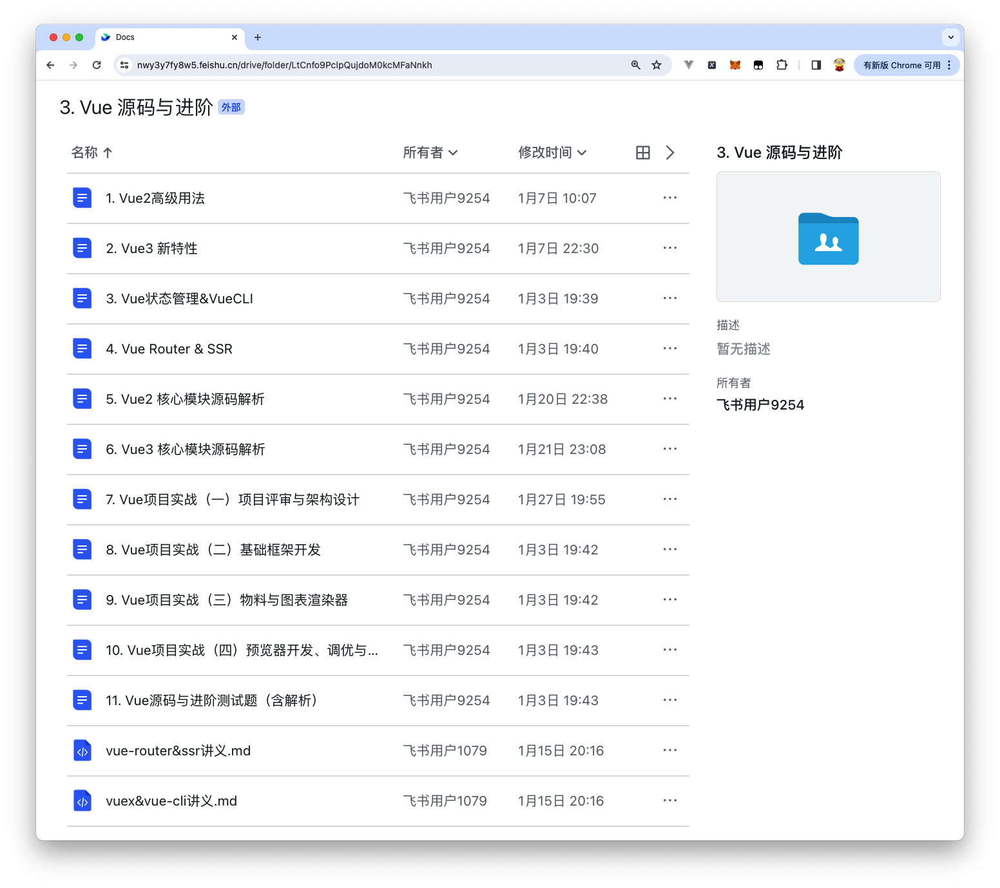

王继勇分享的印客学院课程

[飞书文档](https://nwy3y7fy8w5.feishu.cn/drive/folder/LtCnfo9PclpQujdoM0kcMFaNnkh)

2024-01-20开课

2024-01-27 课程: Vue项目实战(一)项目评审与架构设计-合
    低代码实战
        - 文档地址:
                - https://nwy3y7fy8w5.feishu.cn/docx/CKYRdn8faomFq1xqST9cd54cnzg
                - 印客学院低代码平台地址:
                        - https://github.com/encode-studio-fe/encode-byelide

​    

    1.项目需求分析评审(入料、编排、渲染、出码 )2. Vue 项目基础架构设计,基于 Vite、Pinia、Vue-Router
    3.构建基础框架(导航、物料、配置 )
    4.编排的选型与实现(流式、画布式、Grid)

最强低代码平台: https://retool.com
最好看的低代码平台: https://framer.com
协同编辑工具-yjs: https://github.com/yjs/yjs
表单校验-vee-validate: https://vee-validate.logaretm.com/v3/guide/rules.html#importing-the-rules

2024-01-28 课程: Vue项目实战（二）基础框架开发